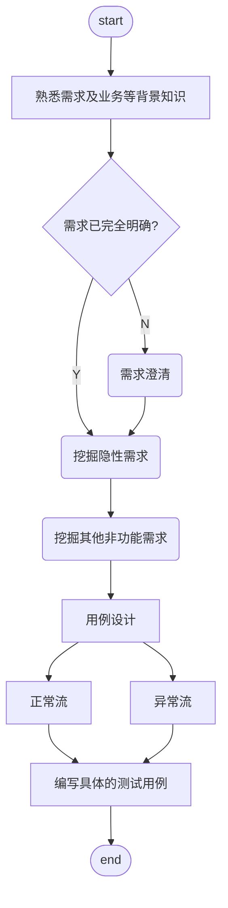

## 01 用xmind进行需求分析的步骤
* 产品名称
    * 模块
        * 功能
            * 子功能
                * 正常场景
                    * 验证...情况下...应该...
                * 异常场景
                    * 情形一
                    * 情形二
                    * 情形三

一般情况下，可根据以上分解步骤用xmind进行测试需求分析。
- 有些功能的最小的单位就是功能，没有子功能，就从功能直接开始分解。
- 功能或子功能下有正常场景和异常场景。
- 功能或子功能下要注意分析**隐形需求**。
- 以异常场景为例，开始分解测试点，直到再也不能分解为止。
- 正常场景看具体业务需求可写一个用例，也可编写多个用例。
- 异常场景绝对要编写多个用例，以便尽可能覆盖所有场景。

## 02 测试用例设计步骤

### 第一步、熟悉需求及业务等背景知识
熟悉需求文档，了解行业知识，业务知识，具备专业的技术水准。
### 第二步、需求澄清
对容易引起歧义或不能完全确定的需求应及时向产品或设计提出澄清。
以便完全明确需求，保证正确理解需求，达成需求理解一致。
### 第三步、需求分析
需求完全明确之后，开始进行需求分析，这一步的目的是为了进行测试点提取
1. **挖掘隐性需求**
    需求中常常包含隐性需求，需要注意深入分析。

2. **挖掘非功能需求**

    通常包含：
    * 测试约束
    * 性能
    * 安全性
    * 易用性
    * 兼容性
### 第四步、用例设计
功能需求、隐形需求、非功能需求（性能、安全、易用性等）构成测试用例的基本维度。然后从基本维度开始往下拆分，
直到功能点不能拆分为止，最顶端的节点就是测试点，一个测试点为一个测试用例。

### 第五步、编写测试用例

测试用例构成要素：
- 用例标题：编写规则为 “验证在什么场景下，做了什么操作，期望达成什么效果”
- 用例编号：每个用例都有唯一的编号
- 需求关联：每个用例将关联一个或多个需求
- 前置条件：用例能顺利执行的前提
- 执行步骤：执行该用例需要进行哪些步骤
- 优先级：用例执行的优先级
- 预期结果：期望的执行结果
- 实际结果：成功or失败

## 03 关键概念

### 隐性需求（Implicit Requirements）定义
隐性需求是指**未在正式需求文档（PRD/用户故事）中明确声明，但系统必须满足的合理要求**。它们源于行业规范、安全准则、用户体验常识和业务领域知识，是保证软件质量不可或缺的部分。

### 典型隐性需求分类（附登录接口实例）
| 类别 | 说明 | 登录接口中的隐性需求示例 |
|------|------|------------------------|
| **安全合规** | 行业安全标准和法规要求 | • 密码传输需加密（即使需求未提） • 错误提示不区分"用户名不存在"和"密码错误"（防暴力破解） • 密码字段禁止明文日志记录 |
| **用户体验** | 用户合理期待的交互逻辑 | • 连续失败登录应有渐进式延迟（防暴力破解） • 会话超时后自动退出 • 移动端键盘自动适配数字/文本类型 |
| **数据健壮性** | 系统对异常数据的处理能力 | • 手机号需验证中国大陆号段规则（13x/18x等） • 密码需过滤SQL注入字符（' OR 1=1） • 非法JSON格式请求应返回400错误 |
| **系统可观测性** | 运维监控需要的支撑能力 | • 登录操作需记录审计日志（IP/时间/结果） • 关键错误需有唯一错误码便于追踪 • 响应时间应<1秒（行业基准） |
| **业务规则** | 领域知识决定的隐含逻辑 | • 同一手机号多次注册应提示"账号已存在" • 新注册用户需完成手机号验证才能登录 • 被风控系统标记的IP应触发二次验证 |

### 为什么测试工程师必须识别隐性需求？
1. **风险预防**
   据IBM研究，修复需求阶段遗漏的问题成本是测试阶段的6倍。识别隐性需求可提前拦截30%+的线上缺陷

2. **安全防线**
   OWASP Top 10中75%的漏洞（如信息泄露）源于未处理的隐性需求。例如登录接口若明确区分"用户不存在"和"密码错误"，会直接导致账户枚举攻击

3. **体验保障**
   用户放弃应用的首要原因是糟糕的体验（Google研究），而80%的体验问题来自未定义的隐性需求。如：未处理网络中断时的登录状态，会导致用户重复提交

### 资深测试工程师的实践方法
1. **5W1H质疑法**
   "如果用户在电梯里（弱网）提交登录会怎样？" "黑客用10万次请求暴力破解如何防护？"

2. **合规映射**
   对照《网络安全法》第22条：网络运营者应采取技术措施防范计算机病毒和网络攻击

3. **缺陷反推**
   分析历史安全事件（如2021年某大厂10亿用户数据泄露），将防护措施转化为测试点

4. **用户旅程模拟**
   从注册→登录→操作全流程，识别需求文档未覆盖的衔接点（如密码修改后旧token应失效）

> **关键认知**：隐性需求不是"需求蔓延"，而是专业测试人员的核心价值。在登录接口案例中，即使PRD只写了"手机号+密码登录"，我们仍需通过测试用例覆盖安全、性能、兼容性等127+个隐性检查点（参考ISTQB高级大纲）。优秀的测试工程师永远在需求字面意思之上，构建质量防护网。