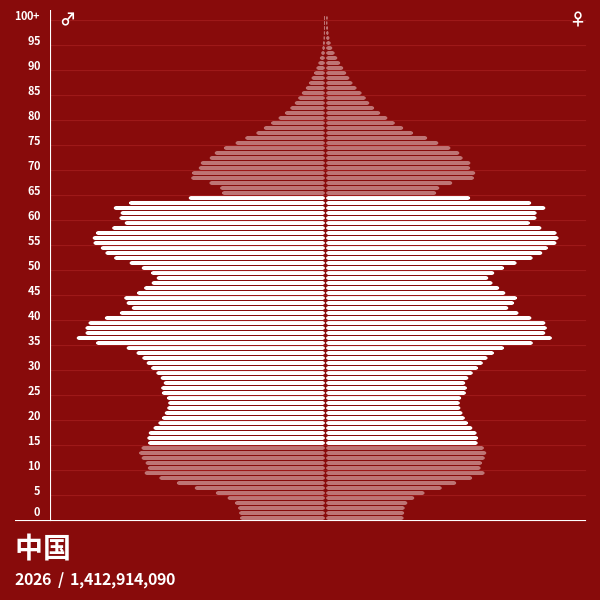
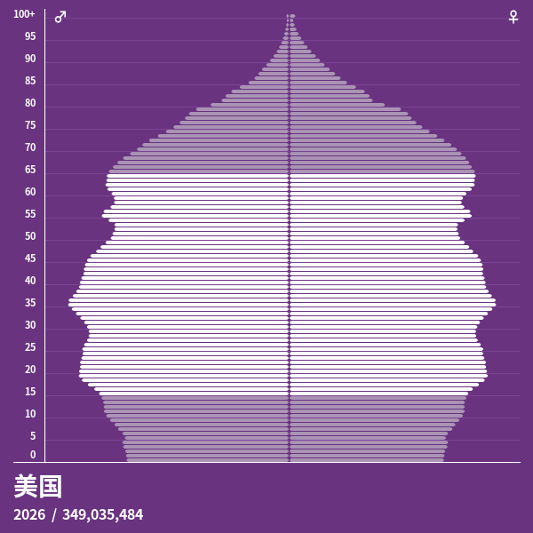
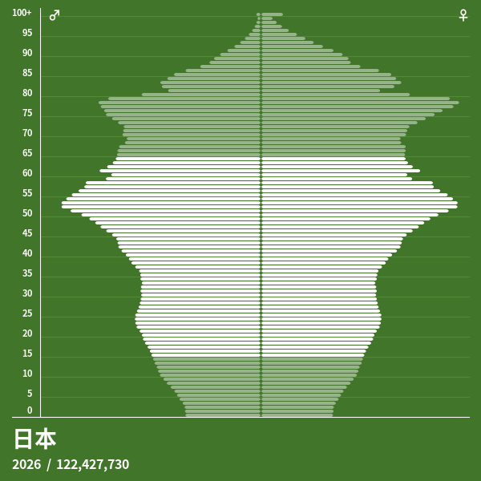
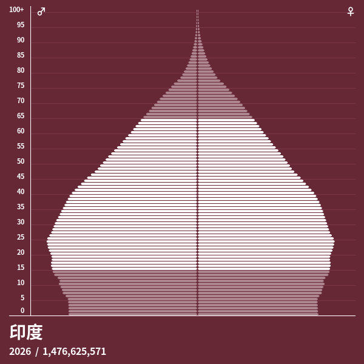
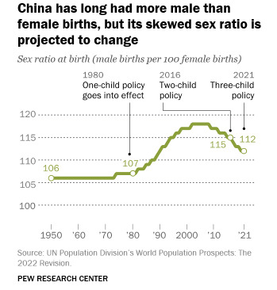

今天早晨一起来，就看到了ryan的推送，讲了一期男女对立。其实我早就想写相关议题了，如婚姻，女权等等。
直到ryan的视频出了之后，我才决定写点自己的想法。

## 为什么男女对立？

为什么当今男女会产生对立？其实在我还是学生时期的时候，大概10几年前，我就已经看到相关话题了，那时候
思考比较少，不懂他们是女权，只凭借自己的传统思维与潜意识感觉到她们是一群“无理取闹”、“胡说八道”的人。
比如微博上、微信上常能看到很多女人发表在我当时看来是“暴论”的观点，例如
- 我不想结婚
- 我不想生孩子，因为会对身体造成不可逆伤害
- 我不想做家务，不想做免费保姆
- 贤惠是骂人
- 女人就是男人发泄性欲的工具而已
- 女人一定要争夺冠姓权，孩子必须跟我姓
- 彩礼是对我的保障
- 原生家庭
- 穿衣自由

## 男女对立的几大原因

ryan 讲到了三点。计划生育、社会保障、经济下行。下面展开说说

### 计划生育

**计划生育出现背景。** 建国初期，受“人多力量大”思想影响，政府曾鼓励生育，效仿苏联给予多子女母亲荣誉称号，并限制节育和人工流产。这一时期总和生育率高达5.9。
1957年，马寅初发表《新人口论》，提出控制人口数量的观点，获得部分领导人认可，但随后在反右运动中受到批判，计划生育未能广泛推行。1958年“大跃进”进一步强化“人多好”的观念。
1962年三年困难时期结束后，出现补偿性生育高峰（第二次婴儿潮），1962-1972年年均出生人口约2669万，累计出生3亿。1969年人口突破8亿，人口与经济、社会、资源、环境的矛盾逐渐显现。1962年中共中央、国务院发出提倡计划生育的指示，但在1970年前未得到全国性有效推行。
进入1970年代，政府对人口过快增长的认识深化。1970年代初，毛泽东等领导人态度转变，在第四个五年计划中提出“一个不少，两个正好，三个多了”的口号。1971年国务院转发计划生育工作报告，将控制人口增长指标纳入国民经济发展计划。1973年成立国务院计划生育领导小组，推行“晚、稀、少”政策（晚婚晚育、生育间隔三年以上、最多两个孩子）。这一阶段人口出生率和自然增长率开始下降，但基数仍大。1976年人口达9.3亿。
1978年改革开放启动后，邓小平、陈云等领导人强调中国“人口多、底子薄、耕地少”的基本国情，认为人口增长过快会制约四个现代化建设。1979年后，政策进一步收紧，1980年9月中共中央发表公开信，*提倡一对夫妇只生育一个孩子*。1982年计划生育被确立为基本国策并写入宪法。其核心目标是通过控制人口数量、提高人口素质，为经济发展创造条件，缓解资源压力。
总体上，计划生育政策的形成是基于当时人口高速增长对粮食、就业、教育、资源分配等形成的现实压力，以及将人口发展纳入国民经济规划的战略考量。它从1950年代的探索、限制，到1970年代的全面推行，再到1980年代的严格化，反映了决策层对人口与经济社会协调发展认识的逐步深化。

  <figure style="flex: 1; text-align: center; margin: 0;">
    
    <figcaption>图1：中国单龄人口金字塔-2026年</figcaption>
  </figure>

  <figure style="flex: 1; text-align: center; margin: 0;">
    
    <figcaption>图2：美国单龄人口金字塔-2026年</figcaption>
  </figure>

  <figure style="flex: 1; text-align: center; margin: 0;">
    
    <figcaption>图3：日本单龄人口金字塔-2026年</figcaption>
  </figure>

  <figure style="flex: 1; text-align: center; margin: 0;">
    
    <figcaption>图4：印度单龄人口金字塔-2026年</figcaption>
  </figure>

根据这几张人口金字塔图 [^1] 就可以看出，中国是一个 **多灾多难** 的国家，日本也比较奇葩。美国和印度就
正常许多。

**粗暴的政策带来的问题。** 在一对夫妇只能生一个孩子的政策下，这些父母为了能够要
儿子但是生出来是女婴的情况下会将女婴遗弃掉，有的会放在公共汽车站，有的直接扔到桥下，甚至溺死。因为超声会被罚款，及强制堕胎，所以在重男轻女、传宗接代的思想加持下，女婴自然就被当成了牺牲品。
B超技术可以验胎儿性别后，女婴就直接会被堕掉，这强烈加剧了性别比的失衡。

**国际收养政策。** 在20世纪80年代末至21世纪初，受独生子女政策和传统重男轻女思想的共同作用，大量健康
女婴被遗弃或送入福利院。在此期间，数以万计（单美国就有超过 70,000 名）的中国女婴被跨国家庭领养，并在海外（如美国、欧洲）长大成人。随着这些女婴成年，许多人开始通过跨国组织如 [China's Children International (CCI)](https://chinaschildreninternational.org/who-we-are) 进行身份认同探讨。同时，由于 DNA 技术的普及，部分海外女婴也开始与中国本土的亲生父母建立联系并跨国寻亲。时间跨度主要集中在 1992年 — 2024年（约32年间）, 民政部于 2024年8月28日 起停止了除外国亲属外的所有跨国收养业务。
在美国纪录片《[found](https://movie.douban.com/subject/35573741/)》中，*中译名：找寻*，就讲述了三个从中国领养的女婴的故事。
关于此有类似层出不穷的研究论文，如：
- 《Where are the missing Chinese girls?》[^2]
- 《Sex-selective abortions over the past four decades in China》[^3]

> 根据皮尤研究中心最近对联合国数据的研究，中国是出生性别比最倾斜的国家之一。事实上，根据2020年联合
> 国报告，1970年至2020年间，中国因性别选择性堕胎或忽视，占全球“失踪”女性的51%。
> 虽然中国出生性别比仍然存在偏差——截至2021年，每100个女孩中有112个男性出生——但这比2002年至2008年间
> 每100个女性出生118个男性高峰略有下降。不过，截至2021年，中国的性别比例差距巨大，男性比女性多出约
> 3000万。根据古特马赫研究所的估计，中国在15至49岁女性中每千名堕胎率是所有国家中最高的国家之一。[^4]

  <figure style="flex: 1; text-align: center; margin: 0;">
    
    <figcaption>图3：中国1950-2021性别比</figcaption>
  </figure>

### 社会保障

第二个原因被认为是社会保障及福利制度不完善甚至是歧视。尤其是婚育女性，在职场有备孕计划/有身孕的女性在就业端是被歧视的，

在评估婚育女性从分娩到哺乳期（通常指产后 1 年内）的社会保障时，各国的政策核心都在于解决“时间（产假/育儿假）”、“经济（津贴/薪酬替代）”以及“职场支持（哺乳时间/弹性工作）”三大问题。
加拿大、美国、日本、韩国与中国在哺乳期间的社会保障政策存在显著的结构性差异。以下为您梳理五国的核心政策对比及深度解析：

**五国哺乳期社会保障核心政策对比表**

| 国家 | 核心假别与总时长 | 哺乳期经济津贴（薪酬替代率） | 职场哺乳权与弹性工作 |
|---|---|---|---|
| 🇨🇦 加拿大 | 孕产假+育儿假 最长可休 18 个月（78 周） | 高福利模式：前 12 个月替代率为 55%；若延长至 18 个月，替代率为 33%（由政府失业保险 EI 支付，有周上限） | 极少人在哺乳期返岗（因假极长）。若返岗，雇主必须提供哺乳/吸奶时间和私密空间。 |
| 🇺🇸 美国 | 无联邦法定带薪假 仅 FMLA 提供 12 周无薪保护 | 无（联邦层面） 仅加州、纽约等约 13-14 个州立法提供 60%-90% 的州级带薪家庭假 | 法律强制保护吸奶权：联邦《PUMP法案》规定，产后 1 年内雇主必须提供带薪/无薪吸奶时间及非洗手间的私密空间。 |
| 🇯🇵 日本 | 产假+育儿休业 通常至孩子 1 岁，最长可延至 2 岁 | 政府全面买单：前 6 个月替代率达 67%（实际免税后接近原手收入的 80%），后期为 50%。若双亲共休可提升至 100% | 育儿短时间勤务：产后可申请每天缩短工时至 6 小时；2025/2026新规强制企业为 3-6 岁家长提供居家办公等弹性选项。 |
| 🇰🇷 韩国 | 产假+育儿休业 育儿假最长可达 1.5 年（18 个月） | 政策激进加码：2025年起政府将育儿假津贴上限大幅调高至每月最高 250万韩元（免除以往“暂扣 25% 待复职发放”的限制）。 | 育儿期劳动时间缩短：不休满育儿假可申请缩短工时，减少的时间由政府进行薪资补贴。 |
| 🇨🇳 中国 | 产假+生育奖励假 通常为 158 天至 188 天不等（视省份而定） | 雇主与社保共担：产假期间发放生育津贴（按用人单位上年度职工月平均工资计发）。 | 哺乳假与哺乳时间：产后 1 年内每天给予 1 小时带薪哺乳时间。部分省份允许申请全假期的“纯哺乳假”。但其间薪资由用人单位承担 |

------------------------------
**加拿大：极高的时间与福利自由度**
加拿大将跨国领养、生育等一并纳入完善的 [加拿大失业保险 (EI)](https://www.canada.ca/en/services/benefits/ei/ei-maternity-parental/benefit-amount.html) 框架。 [^5]

* 母亲可以自由选择“标准假（1年）”或“延长假（1.5年）”。由于假期直接覆盖了世卫组织推荐的婴儿纯母乳喂养及辅食添加期，加拿大女性在哺乳期间几乎不需要在职场背奶，而是全职在家育儿并领取政府津贴。 [^6]  [^7]

**美国：联邦保障缺失，依赖“职场吸奶权”法案**
美国是发达国家中唯一没有联邦法定带薪产假的国家。

* 因为带薪假严重缺失，多数美国女性在产后 6-12 周即被迫重返职场。为了保障哺乳，美国通过联邦《PUMP Act（保护哺乳母亲法案）》强化了“背奶妈妈”的权益。法律强制规定：雇主必须在员工产后 1 年内，为其提供“除洗手间以外的、免受视线干扰和侵入的私密吸奶空间”，以及专门的吸奶时间。[^8]

**日本：高额免税津贴与“工时缩短”制度**
日本为了扭转极低的生育率，近年来高频修正《育儿及家庭护理休业法》。 [^16]

* 经济支持： 育儿休业给付金由社会保险（雇用保险）支付，不仅不扣个人所得税，还免除社会保险费，实际到手收入非常高。
* 哺乳返岗衔接： 日本法律设有 “短时间勤务制度”。哺乳期女性如果选择提早返岗，只要孩子未满 3 岁，原则上每天可以只工作 6 小时（少工作的 2 小时通常不发薪，但确保了哺乳和接送小孩的时间）。 [^9]  [^10] [^11]

**韩国：应对“超低生育率”的激进经济补贴**
韩国面临全球最严峻的人口通缩危机，其社保政策在 2025 年和 2026 年迎来了历史性地大幅度加码。 [^13]

* 津贴暴涨： 过去韩国育儿假上限较低且会扣留 25% 作为复职保证金。目前新政已将每月津贴上限直接拉高到 250 万韩元（约合人民币 1.3 万元），并取消扣留，按月全额发放。
* 弹性替换： 韩国允许女性将不休的育儿假转为“工时缩短”，减少工时导致的薪资损失由国家财政直接补齐，对需要频繁哺乳的职场女性非常友好。 [^14]  [^15]

**中国：由“生育基金/用人单位”全额保障替代**
与上述四国主要依赖长期“政府低比例低保性津贴”不同，中国采取了“短假期、高替代”的模式。

* 薪资不打折： 中国女性在 158-188 天的产假期间，领取的生育津贴是按照用人单位平均工资 100% 替代的，这在国际上属于极高水平（加美日韩均有不同幅度的打折或封顶）。
* 法定哺乳时间： 在女职工产后 1 年的哺乳期内，中国《女职工劳动保护特别规定》明确企业必须在每天的劳动时间内安排 1 小时带薪哺乳时间。多胞胎生育的，每多哺乳一个婴儿每天增加 1 小时。 [^12]

也就是说中国相比这些国家，对婚育女性的保障是最差的。

### 经济下行

后疫情时代，加之房地产市场的缩水与泡沫破裂，经济进入了衰退期，应届生毕业找不到工作的趋势日益严重。
导致

### 我对相亲的体验及对婚姻的看法

**相亲市场对男性的要求太高**。由于女性向上选择的思维惯性，导致相亲市场可选择男性的范围太小，
但是能流入相亲市场的适婚男性在某种程度上确实是相对比较下乘的，这也解释了线下相亲市场到场男女比例悬殊的原因。
**相亲的人大多在寻找爱情而不是婚姻** 。大多人几乎从上学到工作谈恋爱的次数为0，进入婚姻大多靠相亲或熟人介绍
导致一生都在寻找爱情而不是婚姻，根本无法区分婚姻与爱情的本质。
**中国婚姻对普通人来说简直就是一场豪赌**。为了结婚背负巨额债务，普通人的容错太低，结婚证并没有什么约束力。

中国婚姻的本质是什么？
- 对性的本能。由于道德礼教的束缚，应该大多数中国男女基本上在婚前的性行为次数为0，出于对性的渴望，
他们需要婚姻来获取。
- 为了养老。中国人的社会保障几乎等同于没有，尤其是农村人。所以农村人即使愿意支付高价彩礼也要
娶个老婆回家，要生育，特别是要男孩。
- 对死亡的恐惧。中国人认为多子多福，打光棍的人生是非常失败的，尤其是底层，将老婆，孩子作为人生
的最大目标。
- 希望有人纪念。祭拜立碑、烧纸上香，等等一系列仪式都是希望被后世记住。

**彩礼的本质**
为什么会有彩礼？过去是对老人的补偿，这笔钱用来补偿养育成本。现在讲究带往小家庭，说是对女性
生育带来的损失的补偿。说到底，一大原因中国人还是太穷了，另一原因就是历史包袱，文化里带出来的东西
轻易改不了。中国人的人生（大多底层）自始至终都在围绕生存，温饱展开。

## 男女对立会带来什么影响

- 无限的初婚年龄推迟
- 人们越来越反感婚姻
- 女性在自身利益上越来越不会让步
- 新人儿数量会越来越少

[^1]: https://population-pyramid.net/ "人口金字塔图数据来源"
[^2]: https://pubmed.ncbi.nlm.nih.gov/12284524/ "失踪的中国女孩在哪里？"
[^3]: https://pubmed.ncbi.nlm.nih.gov/39984920/ "过去四十年中国的性别选择性堕胎"
[^4]: https://www.pewresearch.org/short-reads/2022/12/05/key-facts-about-chinas-declining-population/ "关于中国人口下降的关键事实"
[^5]: https://www.canada.ca/en/services/benefits/ei/ei-maternity-parental/benefit-amount.html "EI产假和父母福利"
[^6]: https://springfinancial.ca/blog/boost-your-income/your-simple-guide-to-maternity-leave-benefits-in-canada/ "您的2026年加拿大产假福利指南"
[^7]: https://help.hellotilt.com/en_us/understanding-canadian-parental-leave-key-differences-from-the-us-BJSfmWjqWx "理解加拿大育婴假：与美国的主要区别"
[^8]: https://worldpopulationreview.com/state-rankings/states-with-paid-family-leave "2026年实行带薪家庭假的州"
[^9]: https://japan.kantei.go.jp/ongoingtopics/policies_kishida/childsupport.html "日本支持儿童和育儿的政策"
[^10]: https://japan-dev.com/blog/paternity-maternity-leave-japan "关于育儿假：日本的陪产假与产假"
[^11]: https://www.atlashxm.com/resources/japan-family-leave-flex-work-2025 "日本将于 2025 年扩大员工的家事假和灵活工作权利"
[^12]: https://finance.sina.cn/zl/2026-04-16/zl-inhuryen7390618.d.html?vt=4&cid=79615&node_id=79615 "任泽平：中国生育报告2026"
[^13]: https://global.lockton.com/us/en/news-insights/south-korea-expands-family-leave-entitlements "韩国扩大家庭假权利"
[^14]: https://www.playroll.com/leave/south-korea "韩国的休假政策"
[^15]: https://www.asinta.com/news/south-korea-expands-parental-leave/ "韩国扩大育儿假：人力资源高管在2025年需要了解的事项"
[^16]: https://www.safeguardglobal.com/resources/blog/japan-5-new-childcare-family-leave-rules/ "日本加强育儿和家庭照护假法律：5项新雇主要求"

