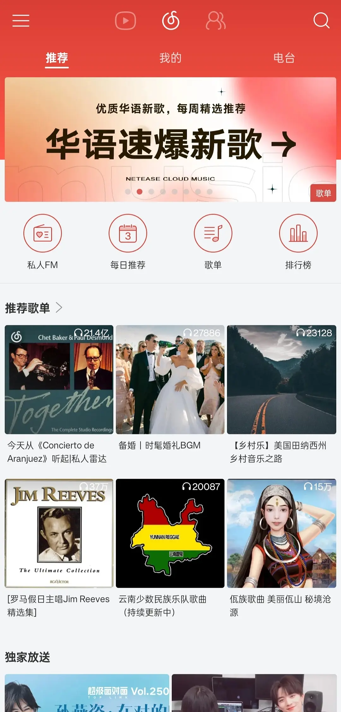

- 历史版本安装包：[https://pan.quark.cn/s/b8e47570d45d#/list/share](https://pan.quark.cn/s/b8e47570d45d#/list/share)
- 网易云各个客户端收录安装包收录：[https://blog.amarea.cn/archives/netease-cloudmusic-history-version.html](https://blog.amarea.cn/archives/netease-cloudmusic-history-version.html)

## 背景
- Android 14
- Color OS 14
- 网易云版本：v5.1.0（好象是最低这个版本可以用微信成功登录，低于就不行）
- 安装日期：2026-07-03

## 安装步骤
直接点击安装包不行，需要用 `adb` 安装:
```bash
# 检查设备连接状态，确保已连接
➜ adb devices
List of devices attached
a20700a3        device
# 先卸载旧版本
➜ adb uninstall com.netease.cloudmusic
Success

# 覆盖安装并允许降级
➜ adb install -r -d "D:\myApp\soft\网易云音乐_v5.1.0_116.apk"
Performing Streamed Install
# 手机一步步点击安装打印 Success 就成功
Success
```

终于不再吃屎了！
<div style="display: flex; gap: 10px; justify-content: center; align-items: flex-start; margin: 15px;">
  <figure style="flex: 1; text-align: center; margin: 0;">
    
    <figcaption>图1：网易云 v5.1.0</figcaption>
  </figure>
</div>

## 阻止烦人的自动更新及其他没意义的请求
我已经抓包了更新接口，将以下规则配置到代理软件中REJECT，比如 clash 里即可拦截。
```text
DOMAIN-SUFFIX,apm.music.163.com
DOMAIN-SUFFIX,clientlog.music.163.com
DOMAIN-SUFFIX,d1.music.126.net
DOMAIN-REGEX,music\.163\.com/eapi/v1/android/version
```