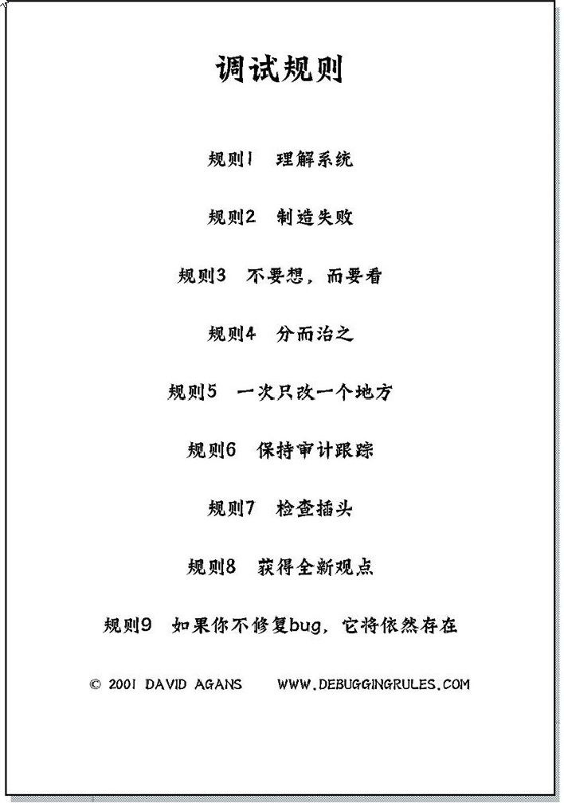

Debugging: The 9 Indispensable Rules for Finding Even the Most Elusive Software and Hardware Problems
中译本翻译为：调试九法:软硬件错误的排查之道，译者：赵俐

  <figure style="flex: 1; text-align: center; margin: 0;">
    
    <figcaption>图1：调试九法</figcaption>
  </figure>

## 法则一 | 理解系统

### 01 阅读手册

1. 阅读手册。（即使手册也可能出错）
2. 阅读代码/代码注释。

### 02 逐字逐句阅读整个手册

1. 手册会提供丰富的信息及前人的经验。
2. 手册也会又不合理的地方，不合理的地方往往就是最容易出问题的地方。

### 03 知道什么是正常的

> 这里有点感想，以前我写不出来自动化测试框架，就是自己的 context 太小，知道的太少
> 比如我不知道模板替换的库。不知道 inspect、不知道 hasattr、getattr、不知道 importlib
> 我就不可能知道怎么做，所以设计不出框架，要是从头来，自己需要学好多好多东西。知识储备
> 是非常重要的，这里理解整个系统是非常重要的。

这里作者想表达的意思是必须具备一些**基础知识**，基础知识不懂，你就不会知道什么是不正常，
什么是错误，也就无法发现问题。
> 比如我刚开始进入公司时，测试视频彩条图像，我不知道怎么测，其实是我不知道什么是正常的
> 什么是不正常

### 04 知道工作流程

了解系统的工作流程才能知道 BUG 的排查路线。

### 05 了解你的工具

辅助你排查错误的调试工具你必须了解。

### 06 查阅手册

养成良好的查阅手册的习惯，注意细节，不要相信自己的记忆和靠猜测行事。

## 法则二 | 制造失败

> 在软件测试中也就是复现bug，复现 BUG 也要有一些技巧，作者给出了以下方法

## 收集 | 比较有意思的主题概念

1. **拇指规则**。英文为 **rule of thumb**，又译为 了「大拇指规则」或 「经验法则」，是一种可用于许多情况的简单的经验性的原则。来源于作者在面试时喜欢问：你喜欢在调试时用什么拇指规则。而本书正是把这些“明显的”规则收集到一起，帮助读者记住他们。
2. **墨菲定律**。Murphy's Law，事情如果有变坏的可能，不管这种可能性有多小，它总会发生

